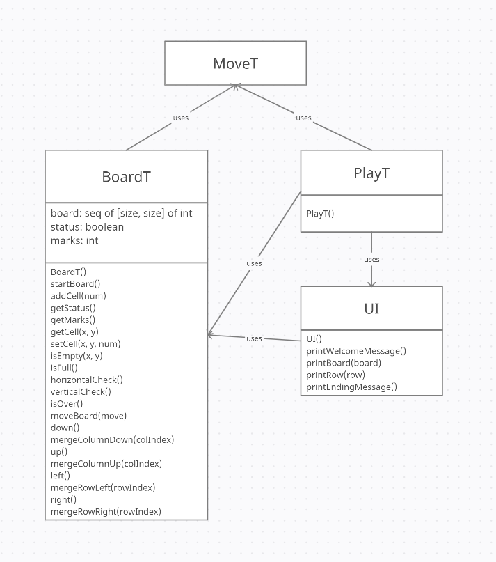

# Text-based 2048 Game
*A java project of a text-based 2048 game, including source code and design specification.*

- Category: JAVA, Requirement Engineering
  
- Keyword: 
  - Object-oriented Design
  - Module Interface Specification (MIS)
  - Design pattern: Module View Specification (MVC)
  - Design principles
- Date: April, 2021

## Table of Contents
- [Text-based 2048 Game](#text-based-2048-game)
  - [Table of Contents](#table-of-contents)
  - [Description](#description)
  - [Design Overview](#design-overview)
  - [Likely Changes](#likely-changes)
  - [Module Interface Specification](#module-interface-specification)
  - [Critique of Design](#critique-of-design)

## Description

In the game, a player moves numbered tiles that slide using the four arrow keys on a plain 4×4 grid. Every turn, a new tile randomly appears in an empty spot on the board with a value of either 2 or 4. If two tiles of the same number collide while moving, they will merge into a tile with the total value of the two tiles that collided. 

A scoreboard keeps track of the user's score. The user's score starts at zero, and is increased whenever two tiles combine, by the value of the new tile. The game is won when a tile with a value of 2048 appears on the board, and when the
player has no legal moves (there are no empty spaces and no adjacent tiles with the same value), the game ends.

## Design Overview

This design applies Module View Specification (MVC) design pattern.

`BoardT` is the model module as it encapsulates the game data as well as the operations on the data. It stores the game board, game status and user marks, and modifies these
data based on the operations (`MoveT`).

`UI` and `PlayT` are the view modules as they work together to display the data from the model components using text-based graphics. The methods in `UI` can display messages and the game board, and they are called by `PlayT`.

`PlayT` is also the controller module since it handles input actions. It asks for a user input, and call corresponding operations on the game board.

A relation diagram is provided below for visualizing the structure of this software architecture:

## Likely Changes

- Data structure used for storing the game board. (In the current design, we use an an arraylist of an arraylist to store the game board, we may use other data types.)

- Type of the user input. (Instead of read input strings and call the corresponding operations, an enumerated class `MoveT` is used, so we can convert input strings to `MoveT` objects. If we change the controller, so that we take keyboard keys instead
of typed input in the future, we only need to modify the converter and make it convert keyboard activities to `MoveT` objects.)

- The view of the design or the format of the output data. (It may use a GUI instead of text-based graphics for further developments.)

- The detailed setup of the game. (For example, we may change the probability of generating a new 4 tile, which is originally 10%. Another example could be adding two new tiles instead of only one once we perform a move.)

- Change of peripheral devices.

## Module Interface Specification

*This Module Interface Specification (MIS) document contains modules, types and methods for implementing the game 2048.*

Read the [MIS document](./MIS.pdf).

## Critique of Design

- The usage of MVC design pattern demonstrates the principle of separation of concerns. 
Data and status are encapsulated into model component, the game board is displayed by the UI in view component, and the controller component handles user inputs.
It improve the reliability and maintainability of the code. 
For example, if we create a GUI for this game, we only need to adapt the view component with the GUI, the other two components remain unchanged. 
The probability of making mistakes is reduced by doing this.

- The MVC design pattern also achieves high cohesion and low coupling. 
The three components are closely related but not strongly dependent on others. 
Similar to the separation of concerns, it also reduce the impact of changing one module on other modules.

- The `isOver()` method in `BoardT` is not minimal as it checks whether the game is over and updates the game status if the game is over. 
I leave it not minimal because we need to immediately update the game status if the game is over according to the rules. 
Otherwise, we might stuck into a dead game or add tiles to a full board, which will cause errors.

- The `isEmpty(x, y)` method in BoardT is unnecessary since we can use `getCell(x, y)== 0` to replace it. 
Although it is not essential, I think it is more rational to use `isEmpty(x, y)` since frequently used by other methods.

- The methods in `BoardT` use the abstract object size instead of a specific number.
This demonstrates information hiding and anticipation of changes. The benefits of doing this will appear when we change the size of game board: the modifications needed will be reduced significantly since we're not going to change several methods,
we can just change the assigned value of size.

- Continuing to the previous point, this will make the design more general.
The change on game rules or game setup will not cause a serial of modifications on code.
The more modifications we do, we are more likely to make mistakes.

- This design is also consistent. The name conventions of modules, getter & setter methods, parameters and exceptions are consistent as shown in the previous MIS.
Besides, the methods name is rational, easy to understand and concludes the functionalities. 
For example, all printing methods in `UI` are named as "printXxxxx".
Another example would be the `mergeColumnDown/Up()` and `mergeRowLeft/Right()` methods. 
They follow the similar naming convention and we can know their functionalities by looking at the method names.
